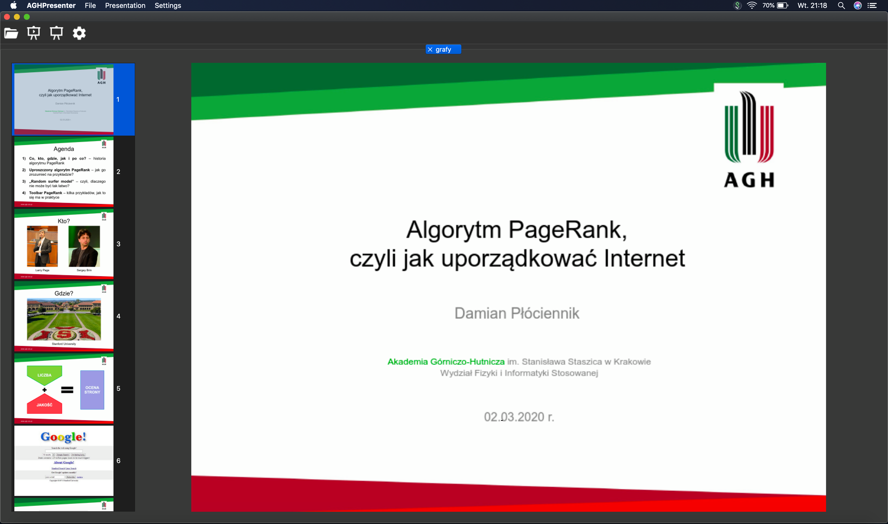

# AGH Presenter
Reader for PDF files with presenter mode.

Project realised as bachelor thesis by [Damian Płóciennik](https://github.com/Vectrom) in the care of supervisor [Maciej Wołoszyn, PhD. Eng.](https://github.com/mwoloszyn)



Application is multiplatform and was compiled and tested on:
- Windows 10
- macOS Catalina 10.15 
- Debian GNU/Linux 10
- Ubuntu 18.04

Instalation packages are provided as artefacts on GitHub Actions.

## Known issues
If fonts were not loaded on Linux systems, probably you should set `FONTCONFIG_PATH` environment variable, e.g.:
```
export FONTCONFIG_PATH=/etc/fonts/
```

## Contributing
If you want to contribute to AGH Presenter or compile this project on your computer, you should read [CONTRIBUTING.MD](CONTRIBUTING.MD) page.